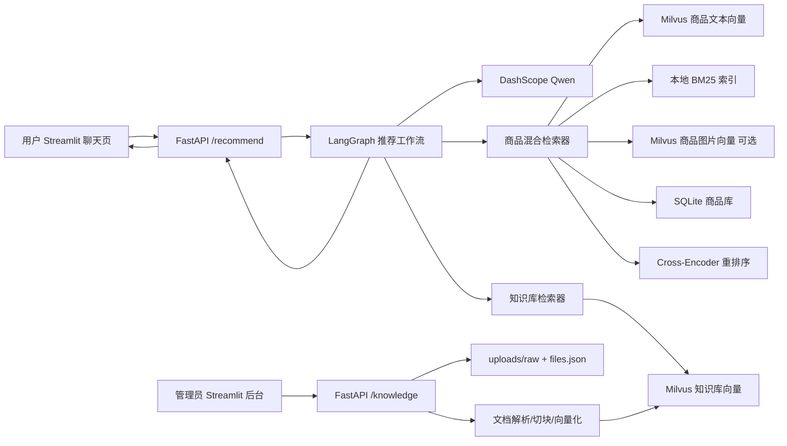
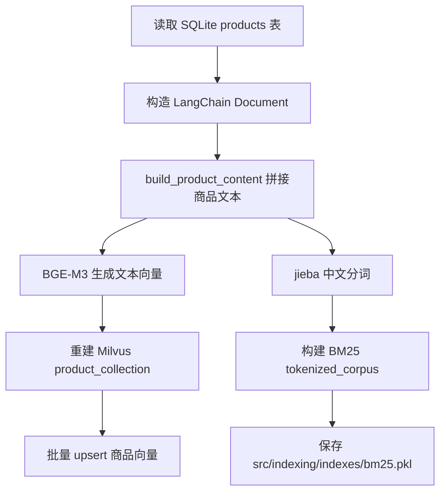
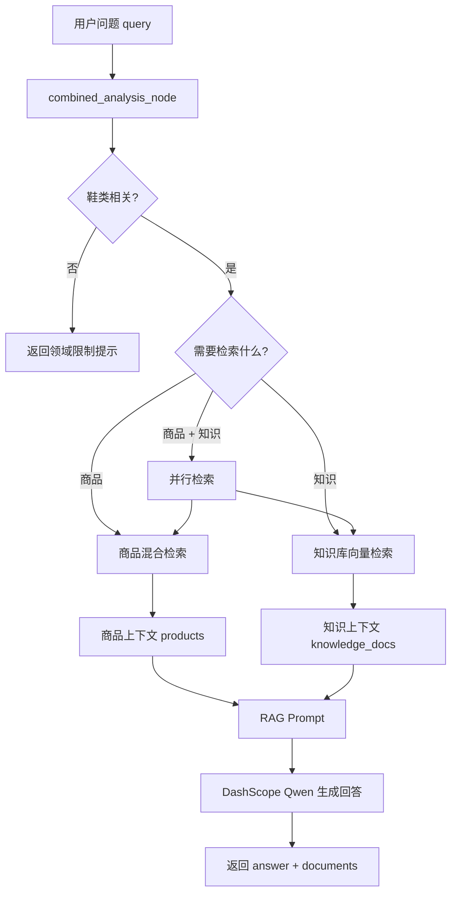
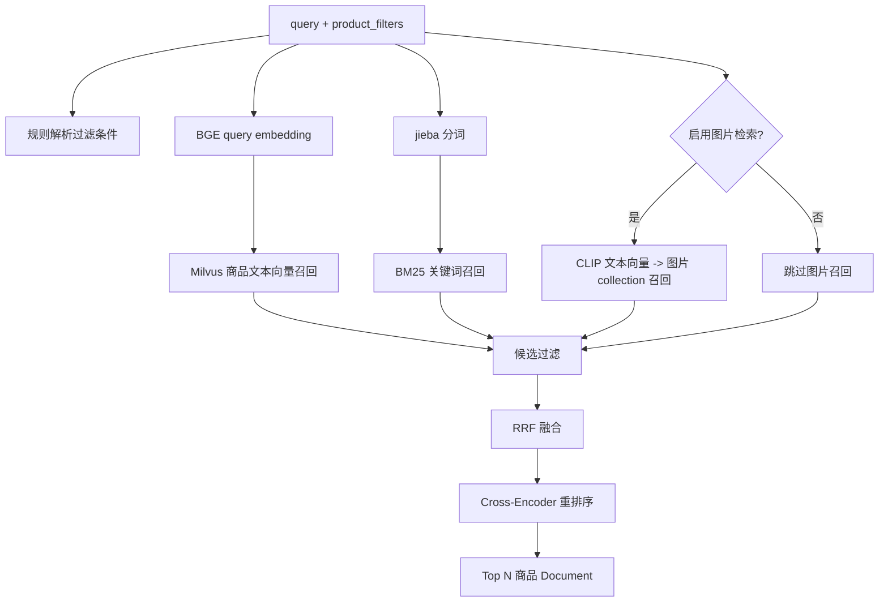
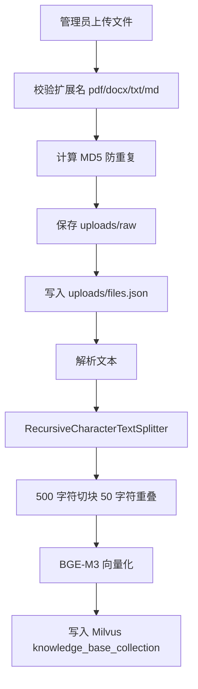
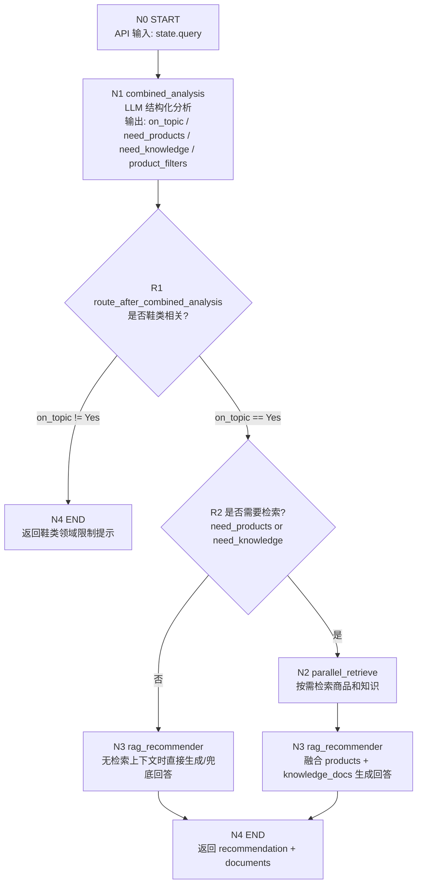
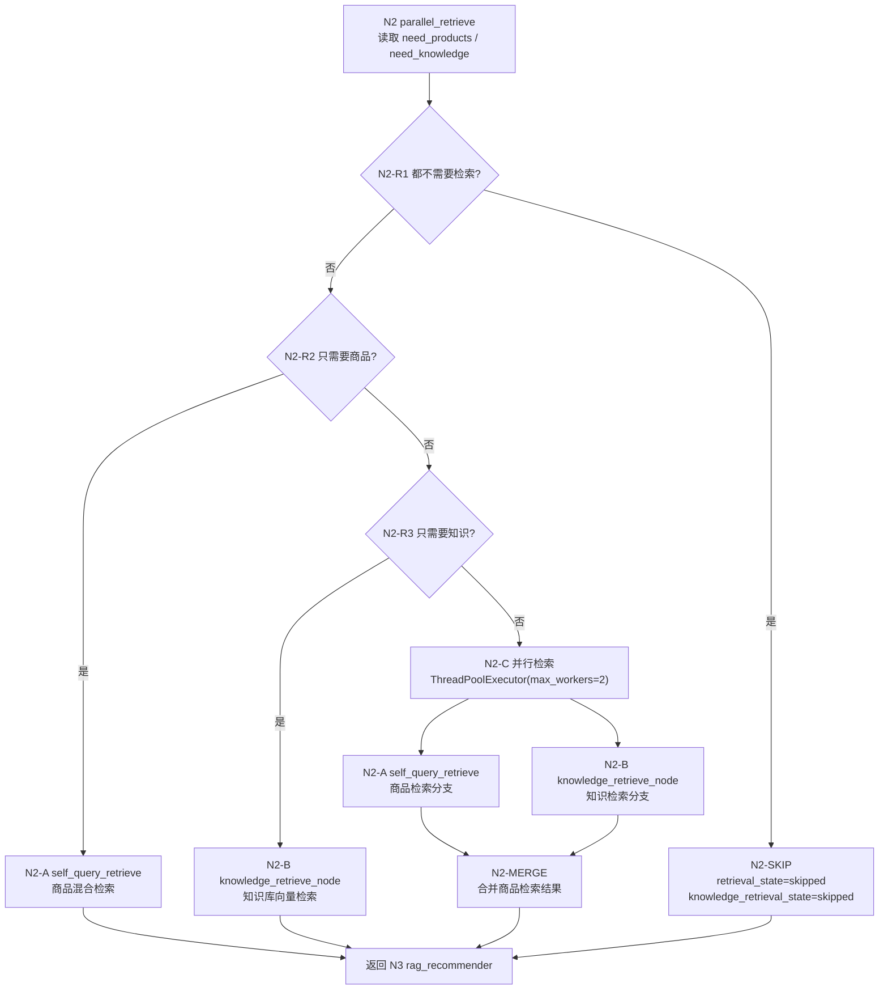

# AI 鞋类智能推荐系统技术文档

## 1. 项目名称

项目名称：`llm-based-recommender`

产品名称：AI 鞋类智能推荐系统

项目定位：基于 LLM、RAG、Milvus 向量检索、BM25 关键词检索和 LangGraph 工作流编排的对话式鞋类导购系统。用户可以用自然语言描述选鞋需求，系统自动理解意图、检索商品库和鞋类知识库，并生成带推荐理由的导购回答。

说明：项目当前核心代码、提示词、前端页面、商品字段和知识库文档均以“鞋类推荐”为主。

## 2. 项目解决的用户需求

传统电商搜索依赖关键词和筛选器，用户需要自己组合“鞋型、颜色、材质、季节、性别、场景”等条件。对于“适合夏天通勤的浅色女鞋”“不要黑色、不要皮鞋，想要透气一点”“推荐跑鞋并说下怎么选尺码”这类自然语言需求，普通搜索很难同时理解场景、偏好、否定条件和知识咨询。

本项目解决的核心需求包括：

- 降低用户选鞋成本：用户直接描述场景、风格和偏好，系统返回具体商品推荐。
- 提升推荐解释性：推荐回答会结合商品资料、材质、场景、颜色、鞋型等信息说明理由。
- 支持知识问答：用户可咨询鞋码、脚型、材质、清洁保养、场景选择、搭配等鞋类知识。
- 支持混合需求：同一个问题中既可以要求商品推荐，也可以要求知识解释。
- 支持多轮追问：通过 `thread_id` 和 LangGraph memory 保留上下文，理解“我要女性的”“便宜点”“不要黑色”等短句追问。
- 支持知识库运营：管理员可以上传、查看、删除 PDF、DOCX、TXT、MD 资料，系统自动解析、切块、向量化并进入知识库检索。

## 3. 核心功能

### 3.1 用户侧功能

- 对话式鞋类推荐：用户输入自然语言需求，系统返回推荐文案和商品列表。
- 商品图片展示：前端根据返回的 `documents[].metadata.image_url` 展示商品图。
- 商品属性展示：支持鞋型、颜色、材质、季节、品牌、人群、场景、鞋跟、功能等属性。
- 历史对话：Streamlit 用户端会将历史对话保存到 `src/ui/chat_memory.json`，支持切换和清空。
- 多轮上下文：API 通过 cookie 保存 `thread_id`，推荐图通过 MemorySaver 保留会话上下文。

### 3.2 管理侧功能

- 知识库文件上传：支持 `pdf`、`docx`、`txt`、`md`。
- 重复文件拦截：基于 MD5 校验重复上传。
- 文件列表查看：展示文件名、类型、大小、上传时间。
- 文件删除：删除本地文件元数据，同时清理 Milvus 中对应 `file_id` 的知识库 chunk。
- 自动索引：上传成功后调用文档处理器，解析文本、切块、向量化、写入 Milvus。

### 3.3 后端 API 功能

- `GET /`：根路径欢迎信息。
- `GET /health`：健康检查，返回 `{"status": "healthy"}`。
- `POST /recommend/`：推荐问答接口。
- `POST /knowledge/upload`：上传知识库文件。
- `GET /knowledge/files`：查看已上传文件列表。
- `DELETE /knowledge/files/{file_id}`：删除知识库文件及其索引。

## 4. 技术栈

| 层级 | 技术/组件 | 作用 |
| --- | --- | --- |
| 后端 API | FastAPI、Pydantic、Uvicorn | 提供推荐接口、知识库接口和健康检查 |
| 前端 | Streamlit、requests | 用户聊天页面和资料管理后台 |
| 工作流编排 | LangGraph、MemorySaver | 编排意图分析、检索、生成流程，并保存多轮上下文 |
| LLM | DashScope ChatTongyi / Qwen | 主题判断、意图分析、结构化过滤条件抽取、最终回答生成 |
| RAG 框架 | LangChain Core / Community | Prompt、Document、OutputParser、模型封装 |
| 向量数据库 | Milvus standalone | 存储商品文本向量、商品图片向量、知识库文本向量 |
| 结构化数据库 | SQLite + FTS5 | 保存商品主数据、结构化字段、全文索引 |
| 文本向量模型 | BGE-M3，或 DashScope text-embedding-v4 | 商品与知识库文本向量化 |
| 图片检索模型 | CLIP text/image 模型 | 可选的文本到商品图片向量检索 |
| 关键词检索 | rank-bm25、jieba | 商品 BM25 召回和中文分词 |
| 重排序 | BGE reranker v2 m3 Cross-Encoder | 对融合候选商品进行精排 |
| 文档解析 | pypdf、python-docx | 解析 PDF 和 DOCX 知识库文件 |
| 部署 | Docker、Docker Compose、etcd、MinIO | 启动 API、UI、Admin、Milvus 及其依赖 |
| 测试 | pytest | 覆盖检索逻辑、文档拼接、文件存储、状态结构等 |

## 5. 使用到的模型

### 5.1 聊天大模型

- 默认模型：`qwen-plus`
- 调用方式：`langchain_community.chat_models.ChatTongyi`
- 配置项：`DASHSCOPE_API_KEY`、`DASHSCOPE_CHAT_MODEL`
- 使用位置：
  - `src/recommender/combined_analysis_node.py`
  - `src/recommender/rag_node.py`
  - `src/shared.py`

聊天模型承担两个关键任务：

- 分析任务：判断问题是否鞋类相关，识别是否需要商品推荐和知识检索，并抽取结构化过滤条件。
- 生成任务：基于商品检索结果和知识库片段生成最终导购回答。

### 5.2 文本 Embedding 模型

默认使用本地 BGE 模型：

- 模型目录：`src/models/bge-m3`
- 配置项：`TEXT_EMBEDDING_PROVIDER=bge`
- 设备配置：`TEXT_EMBEDDING_DEVICE=cpu` 或 `cuda`
- 使用封装：`src.shared.create_embedding_model()`

可选使用 DashScope embedding：

- 模型名：`text-embedding-v4`
- 配置项：`TEXT_EMBEDDING_PROVIDER=dashscope`

文本 embedding 用于：

- 商品文本向量索引构建。
- 商品向量召回。
- 知识库文档 chunk 向量化。
- 知识库向量召回。

### 5.3 Cross-Encoder 重排序模型

- 默认模型目录：`src/models/bge-reranker-v2-m3`
- 配置项：`CROSS_ENCODER_MODEL_NAME`
- 使用位置：`src/retriever/hybrid_retriever.py`

作用：对 RRF 融合后的商品候选进行 query-document 成对打分，取 `RERANK_TOP_N` 个最终商品。

### 5.4 CLIP 多模态模型

- 文本模型：`sentence-transformers/clip-ViT-B-32-multilingual-v1`
- 图片模型：`sentence-transformers/clip-ViT-B-32`
- 配置项：`ENABLE_MULTIMODAL_RETRIEVER`、`CLIP_TEXT_MODEL_NAME`、`CLIP_IMAGE_MODEL_NAME`
- 使用位置：`src/retriever/multimodal_retriever.py`

作用：将用户文本查询编码为 CLIP 向量，在商品图片向量 collection 中检索视觉相似商品。Docker 默认关闭该能力，降低运行依赖。

## 6. 系统架构



## 7. 数据设计

### 7.1 商品结构化数据

商品主数据存放在 SQLite：

```text
src/database/enriched_products.db
```

核心表：`products`

重要字段包括：

- 基础信息：`id`、`title`、`image_url`、`description`
- 类目字段：`category_l1`、`category_l2`、`category_l3`、`category_l4`
- 鞋类属性：`shoe_type`、`heel_type`、`closure_type`
- 推荐属性：`brand`、`material`、`season`、`style`、`color`、`gender`
- 使用场景：`target_user`、`usage_scene`、`functionality`
- 图片/文本颜色：`text_color`、`image_color`、`color_source`、`color_confidence`
- 检索文本：`content_text`
- 其他：`rating`、`sales_count`、`stock_status`、`raw_json`

SQLite 同时创建了：

- 普通索引：品牌、材质、季节、性别、鞋型、库存、评分等。
- FTS5 表：`products_fts`，用于标题、品牌、材质、风格、内容文本的全文检索。
- 触发器：商品插入、删除、更新时同步维护 FTS5 表。

### 7.2 商品文档化

商品进入向量索引前，会由 `src/retriever/product_documents.py` 拼接成文本：

```text
title: ...
description: ...
category_l1: ...
brand: ...
shoe_type: ...
color: ...
material: ...
season: ...
usage_scene: ...
functionality: ...
tags: ...
```

该文本同时用于：

- BGE embedding 向量化。
- BM25 tokenized corpus。
- RAG 生成时的商品上下文。

### 7.3 知识库数据

知识库原始文件保存到：

```text
uploads/raw/{file_id}.{ext}
```

文件元数据保存到：

```text
uploads/files.json
```

每个知识库文件解析后切分为多个 chunk，每个 chunk 元数据包含：

- `file_id`
- `source_filename`
- `chunk_size`
- `chunk_index`
- `chunk_id`

知识库 chunk 写入 Milvus collection：

```text
knowledge_base_collection
```

## 8. 商品索引构建流程

入口命令：

```powershell
conda run -n rag_env python -m src.indexing.embedding
```

流程如下：



写入 Milvus 时使用：

- 主键：商品 `id`
- 向量字段：`vector`
- 文本字段：`page_content`
- 元数据字段：`metadata`
- 索引类型：`AUTOINDEX`
- 相似度：`COSINE`

## 9. RAG 流程

本项目 RAG 分成两条检索线：商品 RAG 和知识库 RAG。最终在 `rag_recommender` 中合并上下文并生成回答。

### 9.1 RAG 总流程



### 9.2 商品 RAG 细节

商品检索入口：`src/recommender/self_query_node.py`

检索器入口：`src/retriever/hybrid_retriever.py`

商品 RAG 的核心步骤：

1. 根据 `need_products` 判断是否需要检索商品。
2. 如果当前问题是短追问，并存在上一轮问题，则合并成搜索语句，例如 `上一轮 query + 当前 query`。
3. 从 LLM 输出和规则解析中合并商品过滤条件。
4. 并行/分别执行三类召回：
   - Milvus 文本向量召回。
   - BM25 关键词召回。
   - CLIP 图片向量召回，可选。
5. 对召回结果应用 metadata 过滤，如性别、品牌、材质、季节、颜色、鞋型排除。
6. 使用 RRF 对不同召回源的候选做融合。
7. 使用 Cross-Encoder reranker 精排。
8. 取 Top N 商品，格式化为 `products` 文本和 `documents` 结构。
9. 将商品上下文交给 LLM 生成推荐文案。

商品混合检索流程：



### 9.3 知识库 RAG 细节

知识库检索入口：`src/recommender/knowledge_retrieve_node.py`

检索器入口：`src/knowledge_base/knowledge_retriever.py`

知识库 RAG 的核心步骤：

1. 判断 `need_knowledge` 是否为 true。
2. 检查 Milvus 知识库 collection 是否存在且行数大于 0。
3. 使用同一个文本 embedding 模型对 query 向量化。
4. 在 `knowledge_base_collection` 中做 COSINE 搜索。
5. 默认取 top 3，并过滤低于 `0.3` 相似度阈值的片段。
6. 格式化为 `[知识片段 n，来源：xxx]` 文本。
7. 交给 RAG prompt 作为 `knowledge` 上下文。

知识库入库流程：



## 10. LangGraph 工作流

工作流定义在：

```text
src/recommender/graph.py
```

当前图由 1 个入口、3 个业务节点、2 个条件路由和 1 个结束节点组成。业务节点如下：

| 节点编号 | Graph 节点名 | 源码位置 | 节点职责 | 主要输入 | 主要输出 |
| --- | --- | --- | --- | --- | --- |
| N0 | START | LangGraph 内置入口 | 接收 API 传入的用户问题 | `query` | 初始 `RecState` |
| N1 | `combined_analysis` | `src/recommender/combined_analysis_node.py` | 一次 LLM 调用完成鞋类主题判断、推荐/知识意图识别、商品过滤条件抽取 | `query`、`previous_query` | `on_topic`、`need_products`、`need_knowledge`、`product_filters`、`intent_analysis` |
| R1 | `route_after_combined_analysis` | `src/recommender/graph.py` | 根据 N1 的分析结果决定终止、检索或直接生成 | `on_topic`、`need_products`、`need_knowledge` | 下一个节点名 |
| N2 | `parallel_retrieve` | `src/recommender/graph.py` | 按需执行商品检索和知识库检索；两者都需要时用线程池并行执行 | `query`、`product_filters`、`need_products`、`need_knowledge` | `products`、`documents`、`knowledge_docs`、检索状态 |
| N2-A | `self_query_retrieve` | `src/recommender/self_query_node.py` | 商品混合检索子节点：Milvus 文本向量 + BM25 + 可选图片向量 + RRF + rerank | `query`、`previous_query`、`product_filters` | `products`、`documents`、`retrieval_state` |
| N2-B | `knowledge_retrieve_node` | `src/recommender/knowledge_retrieve_node.py` | 知识库检索子节点：查询 Milvus 知识库 collection | `query` | `knowledge_docs`、`knowledge_retrieval_state` |
| N3 | `rag_recommender` | `src/recommender/rag_node.py` | 将商品上下文和知识库上下文写入 RAG prompt，调用 Qwen 生成最终回答 | `query`、`products`、`knowledge_docs` | `recommendation`、`previous_query` |
| N4 | END | LangGraph 内置结束 | 返回最终 state 给 API | `recommendation`、`documents` | API 响应 |

Graph 流程如下：



`parallel_retrieve` 内部逻辑：



节点路由条件：

| 路由 | 条件 | 去向 | 说明 |
| --- | --- | --- | --- |
| R1 | `on_topic != "Yes"` | END | 非鞋类问题直接结束，返回领域限制提示 |
| R1 | `on_topic == "Yes"` 且 `need_products or need_knowledge` | N2 | 需要商品或知识检索，进入检索节点 |
| R1 | `on_topic == "Yes"` 且两者都不需要 | N3 | 不检索，直接进入生成节点 |
| N2-R1 | `not need_products and not need_knowledge` | N2-SKIP | 标记检索跳过 |
| N2-R2 | `need_products and not need_knowledge` | N2-A | 只执行商品检索 |
| N2-R3 | `need_knowledge and not need_products` | N2-B | 只执行知识库检索 |
| N2-C | `need_products and need_knowledge` | N2-A + N2-B | 商品和知识两个分支并行执行 |

推荐状态 `RecState` 中的关键字段：

| 字段 | 说明 |
| --- | --- |
| `query` | 当前用户问题 |
| `previous_query` | 上一轮问题，用于理解追问 |
| `on_topic` | 是否鞋类相关，`Yes` 或 `No` |
| `need_products` | 是否需要商品推荐 |
| `need_knowledge` | 是否需要知识资料 |
| `product_filters` | LLM 和规则抽取的商品过滤条件 |
| `products` | 格式化后的商品上下文 |
| `knowledge_docs` | 格式化后的知识库上下文 |
| `documents` | 返回前端展示的商品文档 |
| `recommendation` | 最终回答 |
| `retrieval_state` | 商品检索状态 |
| `knowledge_retrieval_state` | 知识检索状态 |
| `error` | 流程错误信息 |

## 11. 关键业务规则

- 非鞋类问题拒答：只有鞋类商品、鞋型、鞋码、材质、功能、搭配、保养、选购等相关问题才继续处理。
- 商品推荐不编造：当 `need_products=true` 但没有检索到商品时，直接返回“暂时没有找到符合条件的商品”，不让 LLM 虚构商品。
- 知识资料可降级：知识库为空或检索异常时不阻断整个流程，系统可只基于商品上下文回答。
- 否定条件优先：如“不要黑色”“皮鞋太闷”，会进入 `exclude_colors` 或 `exclude_shoe_types`，并优先于 include 条件。
- 过滤条件合并：LLM 抽取结果和规则解析结果会合并，规则侧对常见颜色、季节、材质、性别、鞋型做兜底。
- 短追问继承上下文：例如上一轮“推荐通勤鞋”，本轮“我要女性的”，检索时会拼接上一轮 query。
- 上传资料去重：相同 MD5 的资料不会重复保存和索引。
- 删除资料同步删索引：删除文件时按 `file_id` 清理 Milvus 中所有对应 chunk。

## 12. 配置说明

核心配置文件：

```text
config.py
```

常用环境变量：

| 配置项 | 默认值 | 说明 |
| --- | --- | --- |
| `DASHSCOPE_API_KEY` | 无 | DashScope API Key，推荐生成必需 |
| `DASHSCOPE_CHAT_MODEL` | `qwen-plus` | 聊天模型 |
| `TEXT_EMBEDDING_PROVIDER` | `bge` | 文本 embedding 提供方 |
| `BGE_TEXT_MODEL_PATH` | `src/models/bge-m3` | 本地 BGE 模型路径 |
| `TEXT_EMBEDDING_DEVICE` | `cuda` | embedding 运行设备，本地可设为 `cpu` |
| `CROSS_ENCODER_MODEL_NAME` | `src/models/bge-reranker-v2-m3` | reranker 模型 |
| `MILVUS_URI` | `http://localhost:19530` | Milvus 地址 |
| `MILVUS_TEXT_COLLECTION_NAME` | `product_collection` | 商品文本向量 collection |
| `MILVUS_IMAGE_COLLECTION_NAME` | `product_image_collection` | 商品图片向量 collection |
| `MILVUS_KNOWLEDGE_COLLECTION_NAME` | `knowledge_base_collection` | 知识库 collection |
| `DENSE_RETRIEVER_TOP_K` | `20` | 向量召回数量 |
| `DENSE_SIMILARITY_THRESHOLD` | `0.2` | 商品向量相似度阈值 |
| `BM25_RETRIEVER_TOP_K` | `20` | BM25 召回数量 |
| `BM25_MIN_SCORE` | `0` | BM25 最低分 |
| `RERANK_TOP_N` | `5` | 最终重排返回商品数 |
| `RRF_K` | `60` | RRF 融合参数 |
| `ENABLE_MULTIMODAL_RETRIEVER` | `true` | 是否启用图片向量检索 |

## 13. 部署与启动

### 13.1 Docker Compose

完整服务包括：

- `etcd`：Milvus 元数据依赖。
- `minio`：Milvus 对象存储依赖。
- `milvus`：向量数据库。
- `api`：FastAPI 后端。
- `ui`：Streamlit 用户端。
- `admin`：Streamlit 管理端。

启动命令：

```powershell
docker compose up -d
```

默认端口：

| 服务 | 端口 |
| --- | --- |
| API | `8000` |
| 用户端 UI | `8501` |
| 管理端 Admin | `8502` |
| Milvus | `19530` |

### 13.2 本地开发

安装依赖：

```powershell
conda env create -f environment.yml
conda run -n rag_env pip install -r requirements.txt
```

启动 API：

```powershell
conda activate rag_env
$env:DASHSCOPE_API_KEY="你的 DashScope Key"
$env:DASHSCOPE_CHAT_MODEL="qwen-plus"
$env:MILVUS_URI="http://127.0.0.1:19530"
$env:TEXT_EMBEDDING_PROVIDER="bge"
$env:TEXT_EMBEDDING_DEVICE="cpu"
python -m uvicorn src.api.main:app --host 127.0.0.1 --port 8000 --reload
```

启动用户端：

```powershell
streamlit run src/ui/app.py --server.port 8501
```

启动管理端：

```powershell
streamlit run src/ui/admin_app.py --server.port 8502
```

## 14. 最终效果

### 14.1 用户输入示例

```text
推荐一双适合夏天通勤的浅色女鞋，不要黑色，也不要太闷。
```

系统会执行：

1. 判断为鞋类相关问题。
2. 识别需要商品推荐，同时也需要鞋类选购知识。
3. 抽取过滤条件：
   - `gender=女`
   - `season=夏`
   - `include_colors=浅色系`
   - `exclude_colors=黑色`
4. 检索商品文本向量、BM25 和可选图片向量。
5. 过滤掉黑色、不符合性别/季节条件的商品。
6. RRF 融合并用 Cross-Encoder 重排。
7. 基于商品资料和知识库生成推荐理由。
8. 前端展示回答、商品图片和商品详情。

### 14.2 知识问答示例

```text
跑鞋怎么选尺码？宽脚应该注意什么？
```

系统会执行：

1. 判断为鞋类知识问题。
2. 跳过商品检索或只执行知识检索。
3. 在知识库 collection 中召回尺码、脚型、跑鞋相关片段。
4. 生成结构化选购建议。

### 14.3 混合需求示例

```text
推荐一双适合跑步的新手跑鞋，顺便说下跑鞋怎么选。
```

系统会同时：

- 检索商品库，返回具体跑鞋候选。
- 检索知识库，补充跑鞋选择标准。
- 生成“推荐商品 + 选择建议”的综合回答。

## 15. 测试与验证

运行全部测试：

```powershell
conda run -n rag_env pytest
```

重点测试文件：

| 测试文件 | 覆盖内容 |
| --- | --- |
| `tests/test_hybrid_retriever.py` | RRF、过滤条件合并、BM25 过滤等检索逻辑 |
| `tests/test_product_documents.py` | 商品文档拼接、中文分词、文档 key |
| `tests/test_knowledge_retriever.py` | 知识库检索逻辑 |
| `tests/test_file_store.py` | 上传文件元数据、MD5 去重、删除 |
| `tests/test_state.py` | 推荐状态结构 |
| `tests/test_combined_analysis_node.py` | 合并分析节点逻辑 |

接口验证：

```powershell
Invoke-RestMethod http://127.0.0.1:8000/health
```

推荐验证：

```powershell
Invoke-RestMethod `
  -Uri "http://127.0.0.1:8000/recommend/" `
  -Method Post `
  -ContentType "application/json; charset=utf-8" `
  -Body '{"question":"推荐一双适合通勤的黑色皮鞋"}'
```

知识库验证：

```powershell
conda run -n rag_env python scripts/index_knowledge_base.py
conda run -n rag_env python -c "from src.knowledge_base.document_processor import get_knowledge_collection_stats; print(get_knowledge_collection_stats())"
```

## 16. 项目亮点

- 用 LangGraph 将 LLM 分析、检索和生成拆成清晰节点，流程可维护、可扩展。
- 将主题判断和意图分析合并为一次结构化 LLM 调用，减少一次模型往返延迟。
- 商品检索不是单一路径，而是 Milvus 向量、BM25、可选图片向量三路召回。
- 使用 RRF 融合多路召回结果，并用 Cross-Encoder 精排，提高推荐相关性。
- 支持否定条件和软硬过滤条件区分，能处理“不要黑色”“皮鞋太闷”等真实口语需求。
- 商品库、知识库分别建模，既能推荐具体商品，也能回答鞋类知识。
- 上传文件自动解析、切块、向量化、入库，形成可运营的 RAG 知识库。
- Docker Compose 覆盖 API、前端、后台、Milvus 及依赖，便于演示和部署。

## 17. 当前限制与后续优化方向

当前限制：

- 历史聊天缓存中可能保留旧对话内容，不影响运行逻辑。
- 商品价格字段当前代码中未作为主要过滤字段出现，价格过滤能力需要结合数据字段进一步补齐。
- 图片向量检索默认依赖 CLIP 模型和图片 collection，Docker 配置中默认关闭。
- 线上权限体系尚未实现，管理端默认部署在可信环境。
- 推荐反馈闭环、点击转化、个性化画像和 A/B 测试尚未接入。

后续可优化方向：

- 增加价格、库存、销量、评分等更完整的结构化过滤。
- 增加检索评测集，量化召回率、重排效果和知识命中率。
- 增加用户反馈按钮，将“满意/不满意/不相关”反馈回流到优化流程。
- 为知识库增加 chunk 级来源定位、版本管理和重新索引能力。
- 将管理员端接入登录鉴权和权限控制。
- 定期清理演示环境中的历史聊天缓存，避免旧对话影响展示观感。
